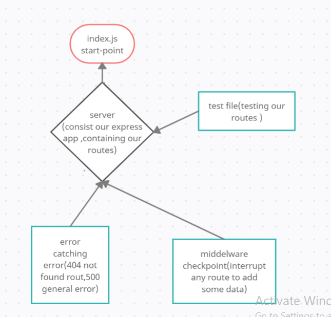

# server-deployment-practice

- Heroku applications for dev branch:https://marwan-server-deploy-dev.herokuapp.com/

- Heroku applications for dev branch:https://marwan-server-deploy-prod.herokuapp.com/

- pull request:https://github.com/marwanrawshedh/server-deployment-practice/pull/3
- pull request:https://github.com/marwanrawshedh/server-deployment-practice/actions

How do I install the app or library?
you have to clone it in you local machine
How do I test the app or library?
npm run test
How do I run the app?
npm run dev

